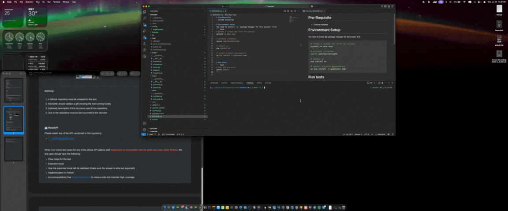

# Pre-Requisite
- Chrome installed

# Environment Setup
You need to install `uv` package manager for this project first
``` bash
# Create a virtual env first for project
python3 -m venv venv

# activate virtualenv
source venv/bin/activate

# install uv
pip install uv

# install projects dependencies
uv pip install -r pyproject.toml
```

# Run tests
``` bash
# Runs all the tests
pytest tests/
```

# Demo
